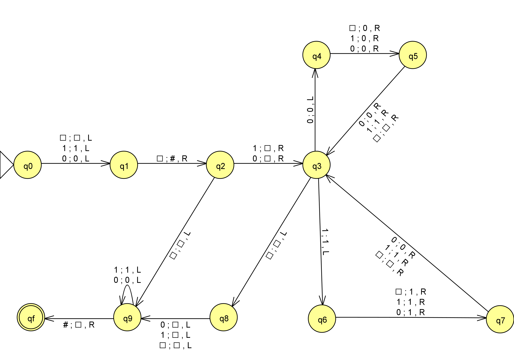
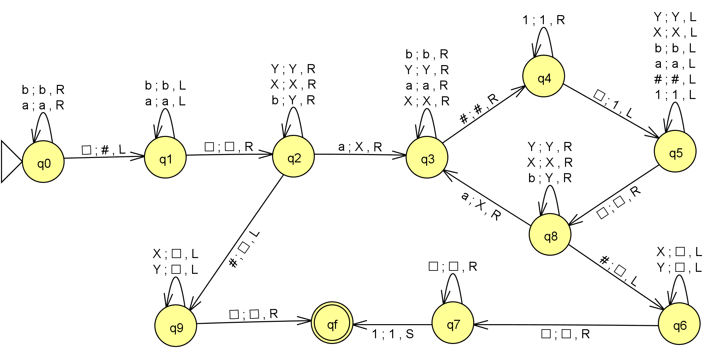
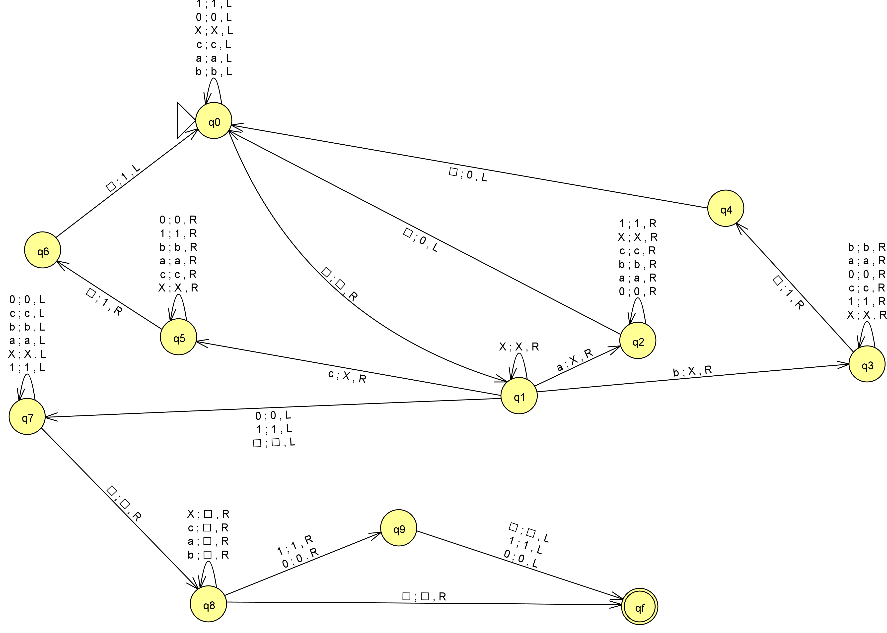
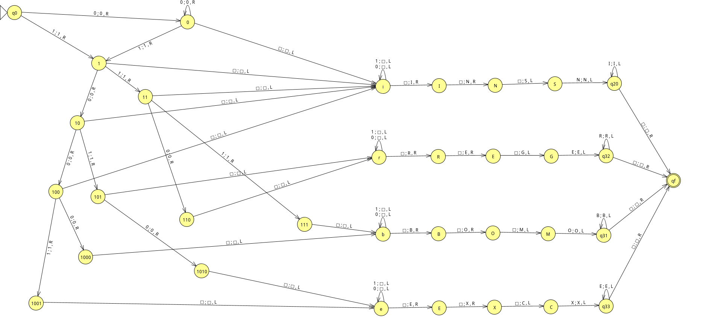
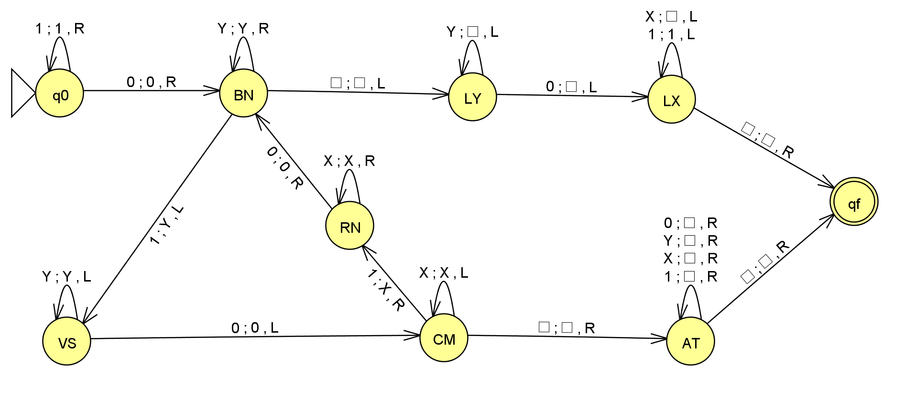

# Máquinas de Turing – Trabalho de  Linguagens Formais e Autômatos

Este repositório reúne as implementações das Máquinas de Turing desenvolvidas para um trabalho da disciplina de  Linguagens Formais e Autômatos.

O objetivo do projeto foi modelar e implementar soluções para diferentes problemas utilizando Máquinas de Turing de fita única, aplicando conceitos como controle de estados, manipulação da fita, uso de marcadores e construção de algoritmos.

## Questões implementadas

### Questão 1 – Contagem de símbolos em uma cadeia


### Questão 2 – Conversão de símbolos para representação binária


### Questão 3 – Remoção do primeiro símbolo da entrada


### Questão 4 – Classificação de notas


### Questão 5 – Subtração em representação unária


## Estrutura do repositório

```text
.
├── imagens/
│   ├── questao1.png
│   ├── questao2.png
│   ├── questao3.png
│   ├── questao4.png
│   └── questao5.png
├── questao1.jff
├── questao2.jff
├── questao3.jff
├── questao4.jff
├── questao5.jff
└── README.md
```

## Ferramenta utilizada

As máquinas foram desenvolvidas utilizando o **JFLAP**, ferramenta amplamente utilizada para a criação e simulação de autômatos e Máquinas de Turing.

## Objetivo

Este repositório tem como finalidade armazenar as implementações das máquinas desenvolvidas, servindo como material de apoio para estudo e consulta sobre os conceitos de Máquinas de Turing e Teoria da Computação.
